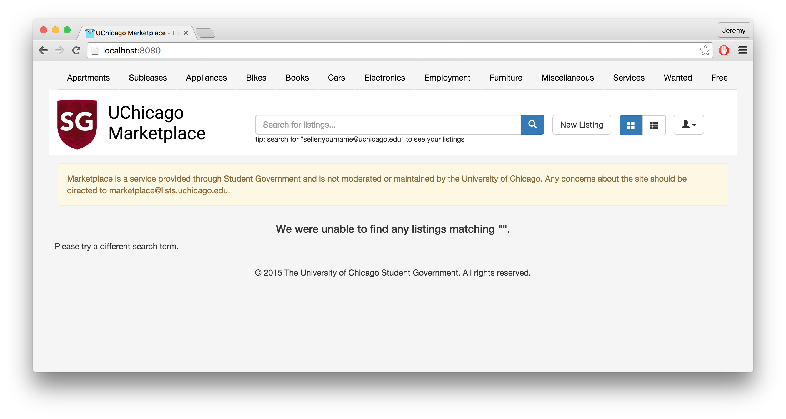

Caravel
=======

Marketplace (codename "Caravel") is a production web service in place at the 
University of Chicago. It is intended to allow students, employees, and
community members to place advertisements of physical goods and services for 
others to use.

The code is written using Python and Flask.

If you'd like to contribute code to the site, start by downloading the Python
[Google App Engine SDK for Python](https://cloud.google.com/appengine/downloads#Google_App_Engine_SDK_for_Python)
and install it on your computer. Once this is complete, you should be able to
run "`dev_appserver.py -h`" from the command line.

Next, download a local copy of the latest Caravel source tree. You can do this
using Git (or download it using a web browser and `cd` into the source tree).

    $ git clone https://github.com/uchicago-sg/caravel.git
    Cloning into 'caravel'...
    remote: Counting objects: 3677, done.
    remote: Compressing objects: 100% (5/5), done.
    remote: Total 3677 (delta 0), reused 0 (delta 0), pack-reused 3672
    Receiving objects: 100% (3677/3677), 3.93 MiB | 872.00 KiB/s, done.
    Resolving deltas: 100% (2203/2203), done.
    Checking connectivity... done.
    $ cd caravel
    $ ls -p
    AGREEMENT.md		cron.yaml		unit_tests.sh
    README.md		dev_appserver.sh	update_vendor.sh
    app.yaml		index.yaml		vendor/
    caravel/		requirements.txt
    circle.yml		requirements_dev.txt

To start a local server, run `dev_appserver.py` in a terminal and open
`http://localhost:8080` in a web browser.

    $ dev_appserver.py .
    INFO     2016-02-15 05:40:36,027 sdk_update_checker.py:229] Checking for updates to the SDK.
    INFO     2016-02-15 05:40:36,373 api_server.py:204] Starting API server at: http://localhost:50375
    INFO     2016-02-15 05:40:36,377 dispatcher.py:197] Starting module "default" running at: http://localhost:8080
    INFO     2016-02-15 05:40:36,378 admin_server.py:118] Starting admin server at: http://localhost:8000

You should see a basic version of the site there. If you keep that command 
running in the background, any changes you make will show up automatically.

All of the code for the site is written in Python, and is contained in the
`caravel/` directory. Inside `caravel/`, there are a number of modules, each
generally maintaining a particular aspect of the application.

    $ ls -p caravel/
    __init__.py	daemons/	static/		templates/	utils/
    controllers/	model/		storage/	tests/

The `caravel/controllers/` and `caravel/daemons/` modules route incoming
requests to various parts of the application. (Internal App Engine features,
like cron and the task queues API, are routed like requests, but aren't meant
to be called by external users. Hence the separation between externally-facing
controllers and daemons.)

    $ grep -B 1 -A10 def.search_listings caravel/controllers/listings.py
    @app.route("/")
    def search_listings():
        """Display a list of listings that match the given query."""

        # Fix session handler if not initialized
        view = request.args.get("v", "th")

        # Parse filtering options from query.
        query = request.args.get("q", "")
        offset = int(request.args.get("offset", "0"))
        if offset < 0:
            offset = 0

Next, the `caravel/model/` directory defines the ways Caravel interacts with
the data storage and email backends. It is structured as a series of mixins,
where a single model class (either a Listing or an Inquiry) imports behaviors
(such as having a price, or being indexed) that are defined in another module.

    $ grep -A10 PriceMixin caravel/model/priced.py
    class PriceMixin(ndb.Model):

        """
        The PriceMixin adds a price to the given entity.

        >>> class D(PriceMixin): pass
        >>> x = D()
        >>> x.price = 3.234444
        >>> key = x.put()
        >>> x.price
        3.23
        """

        price = FixedPoint(default=0)

Finally, the `carevel/static/` and `caravel/templates/` directories define the
resources and skin of the site. Most things that are user-facing (but not
business logic) can be specified here.

    $ head -n 10 caravel/listings/thumbnail.html
    

      

        <a href="{{ url_for('show_listing', listing=listing,
                      q=request.args.get('q')) }}">
          
            
          
            
          

Once you've made a change, you'll want to add or modify a unit test, so that we
can make sure the bug isn't broken in the future. To do that, look at the tests
in the `caravel/tests/` directory.

    $ grep -B 2 -A9 test_indexing caravel/tests/test_listings.py
    class TestListings(helper.CaravelTestCase):

        def test_indexing(self):
            # Test normal indexing.
            self.assertFalse(self.listing_a.old)
            self.assertLongString("\n".join(sorted(self.listing_a.keywords)))

            # Test that old listings are de-indexed.
            self.listing_a.posted_at = datetime.datetime(2003, 2, 3)

            self.assertTrue(self.listing_a.old)
            self.assertEquals(self.listing_a.keywords, [])

Once changed, the unit tests can be run by executing the `./unit_tests.sh`
script, which installs a virtual environment and runs the tests.

    $ ./unit_tests.py
    WARNING:root:No ssl package found. urlfetch will not be able to validate SSL certificates.
    ..........ss.s........
    ..........................
    ----------------------------------------------------------------------
    Ran 48 tests in 2.647s

    OK (skipped=3)
    Name                                            Stmts   Miss  Cover
    -------------------------------------------------------------------
    caravel/__init__.py                                24      0   100%
    caravel/controllers/__init__.py                     0      0   100%
    caravel/controllers/api.py                         35      5    86%
    caravel/controllers/custom_fields.py               71     11    85%
    caravel/controllers/forms.py                       30      0   100%
    caravel/controllers/listings.py                   142     13    91%
    caravel/controllers/moderation.py                  33      6    82%
    caravel/daemons/__init__.py                         0      0   100%
    caravel/daemons/delete_old_photos.py                4      2    50%
    caravel/daemons/migration.py                       13      0   100%
    caravel/daemons/nag_moderators.py                  11      1    91%
    caravel/model/__init__.py                           3      0   100%
    caravel/model/attachments.py                       67     13    81%
    caravel/model/categories.py                         5      0   100%
    caravel/model/full_text.py                         49      0   100%
    caravel/model/inquiry.py                           19      0   100%
    caravel/model/listing.py                           49      2    96%
    caravel/model/migration.py                         24      0   100%
    caravel/model/moderation.py                        31      1    97%
    caravel/model/priced.py                            10      0   100%
    caravel/model/principal.py                          8      1    88%
    caravel/model/rate_limits.py                       23      1    96%
    caravel/model/sellable.py                           3      0   100%
    caravel/model/side_effects.py                       9      0   100%
    caravel/model/temporal.py                           8      0   100%
    caravel/storage/__init__.py                         0      0   100%
    caravel/storage/config.py                          19      1    95%
    caravel/storage/dos.py                             12      0   100%
    caravel/tests/__init__.py                           0      0   100%
    caravel/tests/helper.py                           104      6    94%
    caravel/tests/test_api.py                          15      0   100%
    caravel/tests/test_dos.py                          32     13    59%
    caravel/tests/test_listings.py                    126      0   100%
    caravel/tests/test_migration.py                    46      0   100%
    caravel/utils/__init__.py                           3      0   100%
    caravel/utils/emails.py                            23      2    91%
    caravel/utils/migrations.py                         0      0   100%
    caravel/utils/principals.py                        49      4    92%
    caravel/utils/tor.py                               20      0   100%
    -------------------------------------------------------------------
    TOTAL                                            1120     82    93%

Assuming you see the `OK` line, you're good! Make a new branch, and send us a 
pull request! (If you got an error about virtualenv being not found, run
`sudo pip install virtualenv`; if `pip` isn't found, run
`sudo easy_install pip`. If `easy_install` isn't found, install Python.)

License
-------

Caravel is covered under the MIT License:

> Copyright (c) 2015 Jeremy Archer and George Teo
> 
> Permission is hereby granted, free of charge, to any person obtaining
> a copy of this software and associated documentation files (the
> "Software"), to deal in the Software without restriction, including
> without limitation the rights to use, copy, modify, merge, publish,
> distribute, sublicense, and/or sell copies of the Software, and to
> permit persons to whom the Software is furnished to do so, subject to
> the following conditions:
> 
> The above copyright notice and this permission notice shall be
> included in all copies or substantial portions of the Software.
> 
> THE SOFTWARE IS PROVIDED "AS IS", WITHOUT WARRANTY OF ANY KIND,
> EXPRESS OR IMPLIED, INCLUDING BUT NOT LIMITED TO THE WARRANTIES OF
> MERCHANTABILITY, FITNESS FOR A PARTICULAR PURPOSE AND
> NONINFRINGEMENT. IN NO EVENT SHALL THE AUTHORS OR COPYRIGHT HOLDERS
> BE LIABLE FOR ANY CLAIM, DAMAGES OR OTHER LIABILITY, WHETHER IN AN
> ACTION OF CONTRACT, TORT OR OTHERWISE, ARISING FROM, OUT OF OR IN
> CONNECTION WITH THE SOFTWARE OR THE USE OR OTHER DEALINGS IN THE
> SOFTWARE.